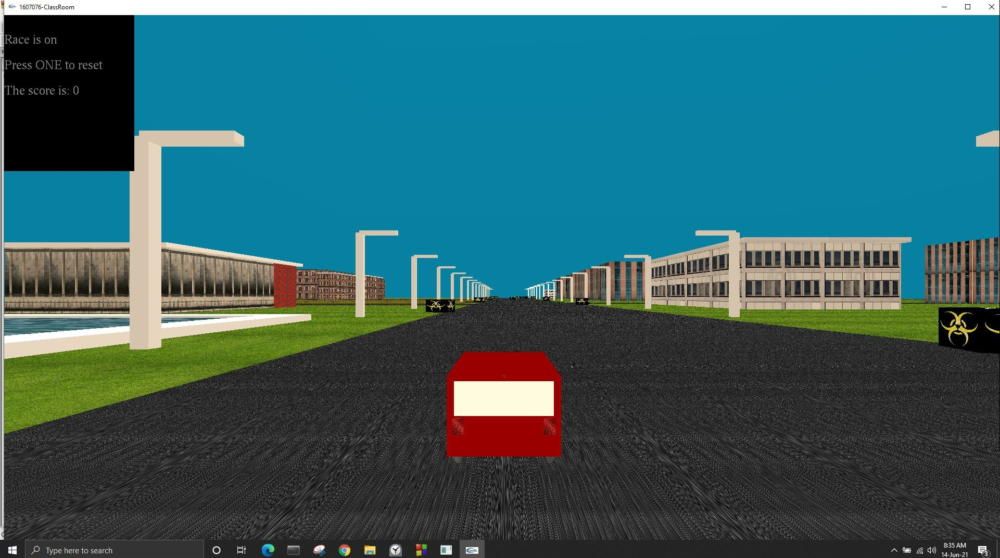
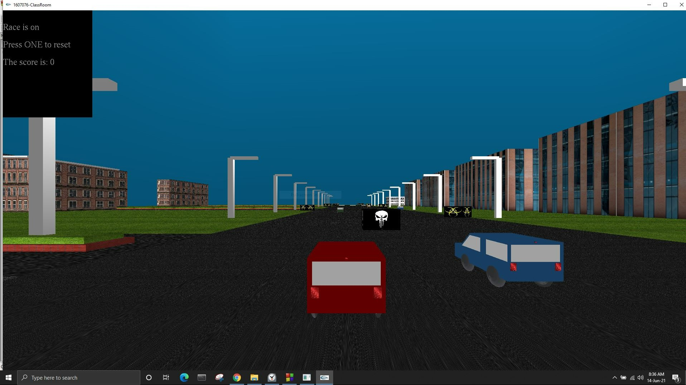
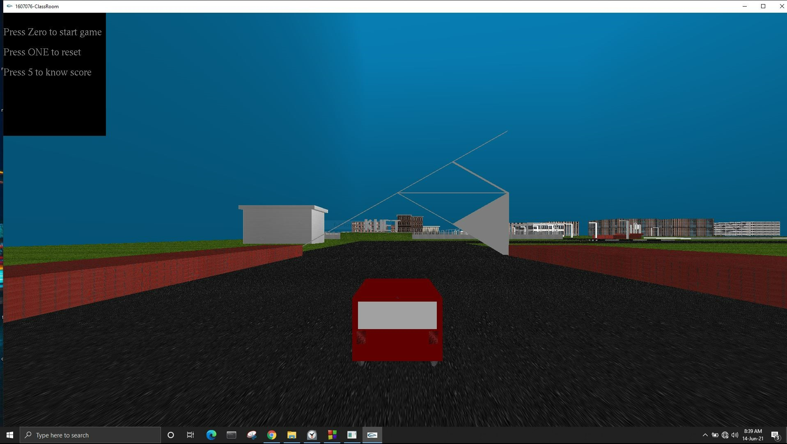

# glutracing

This is the final project for graphics 4208 created using glut in opengl. 

<big><strong>Technical Details:</strong></big>
<ul>
<li>Language: C++</li>
<li>API: OpenGL</li>

</ul>

<big><strong>Features:</strong></big>
<ul>
<li>Player can roam in the environment inspired by KUET</li>
<li>If a player wants to race, he can just go to the designated spot and the game will start</li>
<li>The goal of the race is to finish in minimum time</li>
<li>If a player hits an obstacle, he will be delayed by 4 seconds</li>
<li>If a player hits one unique obstacle, he will be out of the game</li>
<li>Best score is the smallest score</li>

</ul>

<big><strong>Preview of the Game:</strong></big>

  
  
  
  
